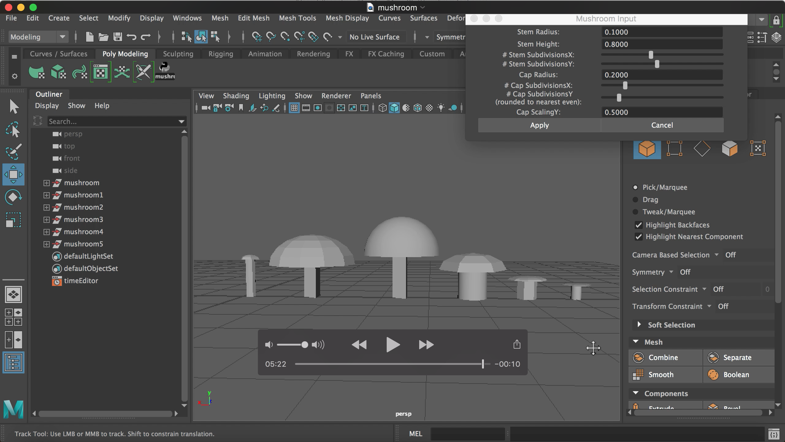

# 🍄Mushroom Generator

This is a tool made with Maya Python scripting to generate low-poly mushrooms. The user can adjust parameters of their mushroom including: stem height, stem radius, number of stem subdivisions in X and Y, cap radius, number of cap subdivisions in X and Y, and scaling of the cap in Y.

[My tool in action!](https://www.youtube.com/watch?v=V2wJjbFZQyU)

